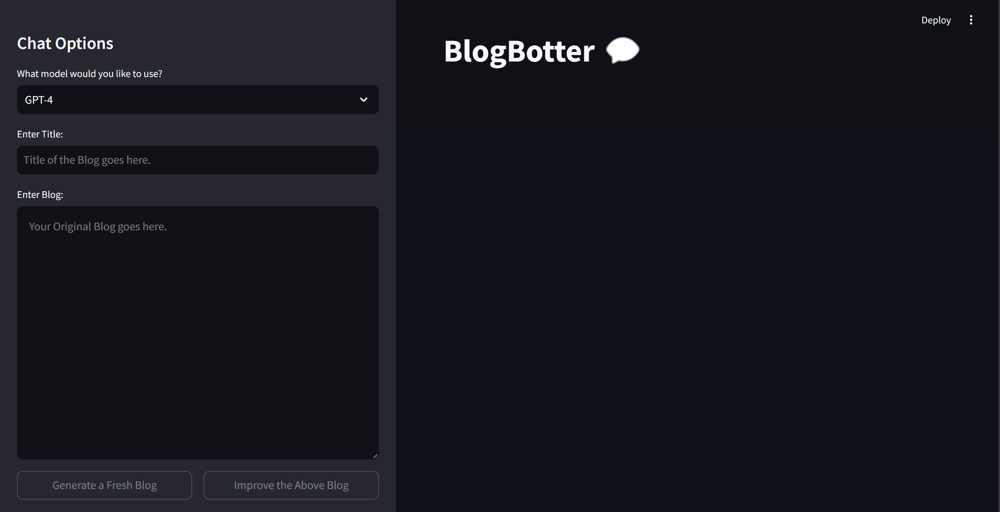
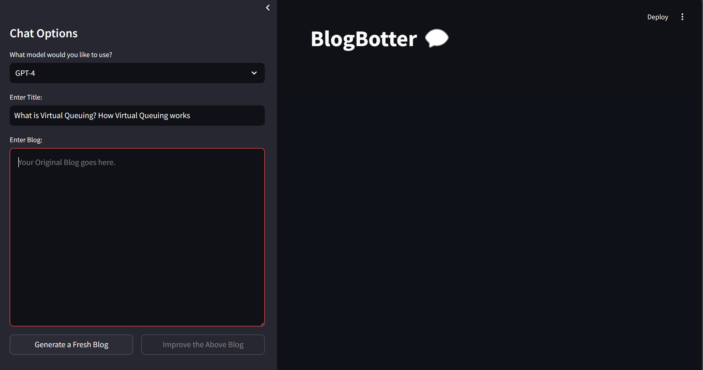
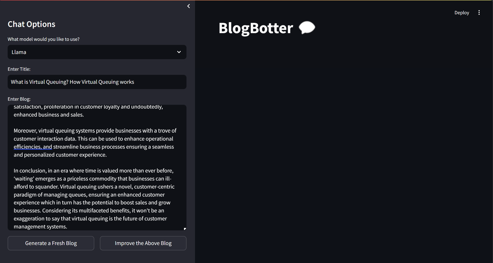
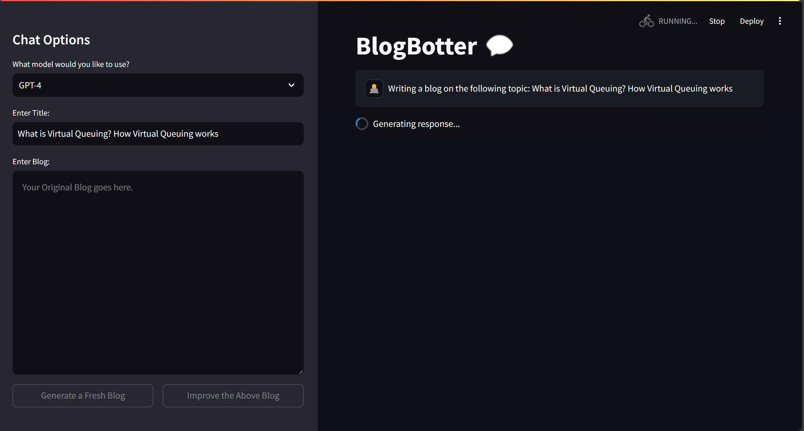
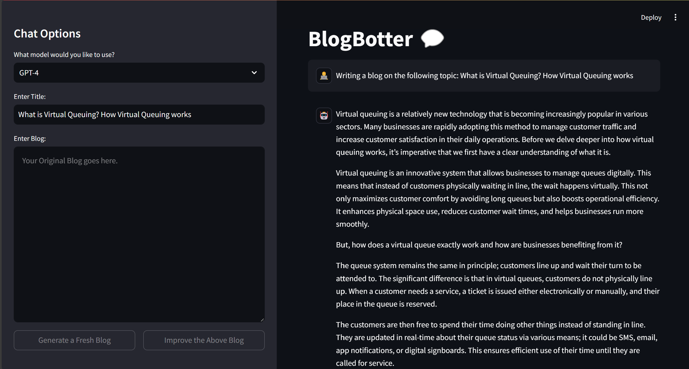
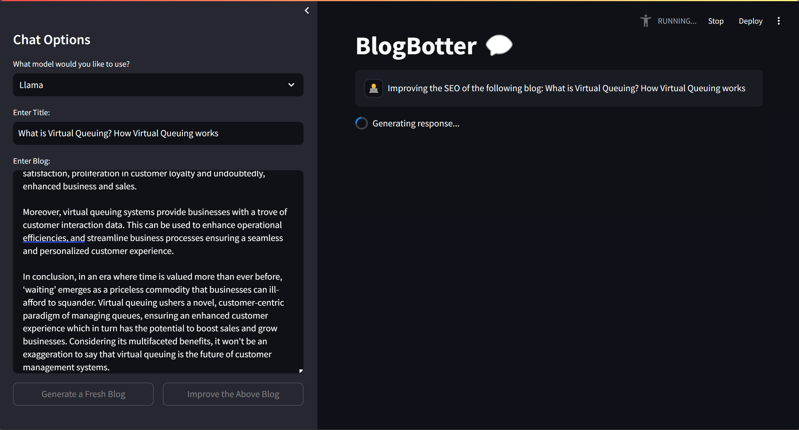
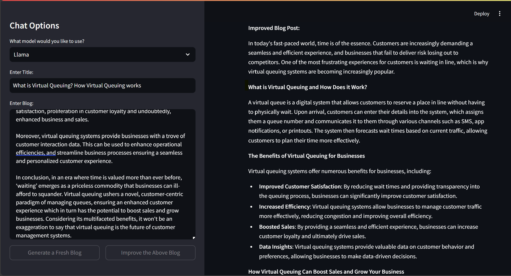
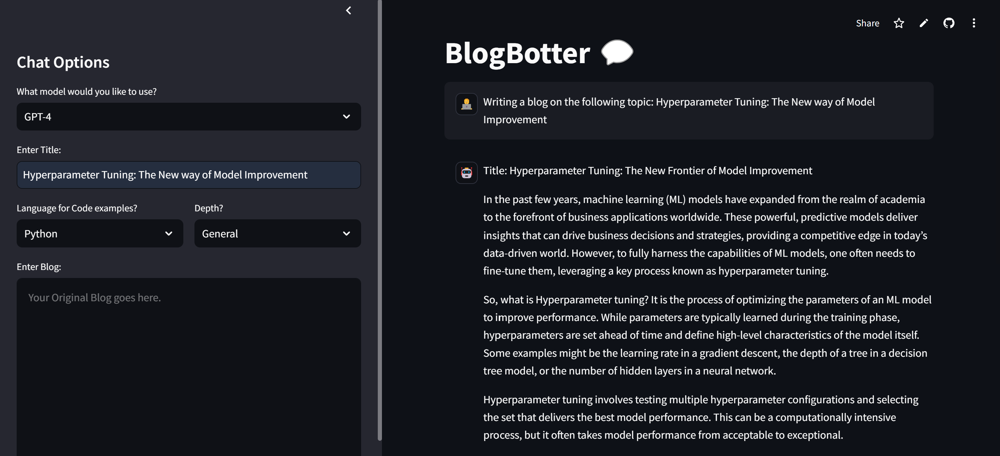

---

title: BlogBotter
emoji: 😻
colorFrom: yellow
colorTo: red
sdk: streamlit
sdk_version: 1.41.1
app_file: app.py
pinned: false

---

# BlogBotter 💬

An AI-powered blog generation and improvement tool built with **Streamlit**. BlogBotter uses a **fine-tuned Mistral-7B** model (via LoRA/PEFT) to generate and improve blog posts, evaluates output quality with **Gemini**, and publishes directly to **WordPress**.

---

## Features

- **Generate Fresh Blogs** — Enter a topic and BlogBotter writes a complete blog using the fine-tuned LLM.
- **Improve Existing Blogs** — Paste your own blog content along with a title to get an SEO-optimized rewrite.
- **Code Language Selection** — Choose between Python and R for code snippet examples within blogs.
- **Depth Control** — Select "General" or "In-Depth" to control the level of detail.
- **Automatic Quality Scoring** — Each generated blog is scored (1–100) by Gemini for quality assessment.
- **WordPress Publishing** — Publish blogs as drafts or live posts directly to a WordPress site via XML-RPC.
- **Auto-Tagging** — Blog tags and categories are automatically generated from the title using NLTK's WordNet lemmatizer and stopword filtering.
- **Azure Blob Storage Logging** — Generated blogs and their scores are persisted to Azure Blob Storage for evaluation tracking.
- **Chat-style UI** — Conversation history is maintained in a chat interface with user and assistant avatars.

---

## Screenshots

### Home Page


### Sidebar — Topic Input
Enter the blog topic in the sidebar to enable generation.



### Sidebar — Topic + Blog Input
Providing both a title and your own blog content enables both the **"Generate a Fresh Blog"** and **"Improve the Above Blog"** buttons.



### Generating a Fresh Blog


### Generated Blog Output
The generated blog is displayed in the main chat area.



### Improving an Existing Blog


### Improved Blog Output
The improved blog appears in the chat area alongside quality score tracking.



### Final Result


---

## Architecture

```
BlogBotter/
├── app.py                        # Streamlit entry point & UI
├── modules/
│   ├── Generate_Response.py      # Blog generation, scoring & Azure logging
│   ├── Rewrite_Content.py        # Fine-tuned Mistral inference & Gemini API
│   ├── WordPress.py              # WordPress XML-RPC publishing
│   └── Get_Tags_Categories.py    # NLTK-based auto-tagging
├── model/                        # LoRA adapter weights (Mistral-7B fine-tune)
│   ├── adapter_model.safetensors
│   ├── adapter_config.json
│   ├── tokenizer.json
│   └── ...
├── css/
│   ├── style.css                 # Streamlit custom styling
│   └── result.css                # Blog output styling
├── data/
│   ├── blog_data.json            # Training/reference blog data
│   ├── blogs/                    # Saved blog outputs
│   └── training/                 # Training data
├── config.json                   # Model & WordPress configuration
├── .env                          # API keys & secrets
├── requirements.txt              # Python dependencies
└── images/                       # Screenshots
```

---

## How It Works

### 1. Blog Generation (Fine-Tuned Mistral-7B)
The primary generation model is a **LoRA fine-tuned Mistral-7B-Instruct-v0.1**, trained on scraped Data Science, ML, and Gen AI blog posts. The adapter is loaded via PEFT with 4-bit quantization (BitsAndBytes NF4) for efficient inference.

**LoRA Config:**
| Parameter | Value |
|---|---|
| Rank (r) | 8 |
| Alpha | 16 |
| Dropout | 0.1 |
| Target Modules | `q_proj`, `v_proj` |
| Task | Causal LM |

### 2. Quality Scoring (Gemini)
After generation, the blog is scored on a 1–100 scale by **Gemini 2.5 Pro** to assess overall quality. The prompt, response, and score are logged together.

### 3. WordPress Publishing
Generated blogs are converted to HTML (via Gemini) and published to WordPress using XML-RPC. The post title is extracted from the HTML `<title>` tag, and tags/categories are auto-generated using NLTK:
- Stopword removal
- WordNet lemmatization
- Title-based category assignment

### 4. Azure Blob Logging
Every generated blog is uploaded to Azure Blob Storage as a `.txt` file, and a running `result.json` log is maintained with prompt, response, and score for each generation.

---

## Tech Stack

| Component | Technology |
|---|---|
| **Frontend** | Streamlit |
| **LLM (Generation)** | Mistral-7B-Instruct-v0.1 + LoRA (PEFT) |
| **LLM (Scoring/HTML)** | Google Gemini 2.5 Pro |
| **Quantization** | BitsAndBytes (4-bit NF4) |
| **NLP** | NLTK (WordNet, Stopwords) |
| **CMS** | WordPress (XML-RPC) |
| **Storage** | Azure Blob Storage |
| **Deep Learning** | PyTorch, Transformers, PEFT |

---

## Setup

### 1. Clone the repository
```bash
git clone <repo-url>
cd BlogBotter
```

### 2. Install dependencies
```bash
pip install -r requirements.txt
```

### 3. Configure environment variables
Create a `.env` file with the following keys:

```env
GEMINI_API=<your-gemini-api-key>
GEMINI_MODEL=gemini-2.5-pro
HF_TOKEN=<your-huggingface-token>
HF_TOKEN_WRITE=<your-hf-write-token>
HF_MODEL=dhruvchandra/BlogGeneration
HF_BASE_MODEL=mistralai/Mistral-7B-Instruct-v0.1
WORDPRESS_USERNAME=<your-wp-username>
WORDPRESS_PASSWORD=<your-wp-app-password>
WORDPRESS_URL=<your-wp-xmlrpc-url>
AZURE_BLOB=<your-azure-blob-sas-url>
```

### 4. Run the app
```bash
streamlit run app.py
```

---

## Requirements

See [`requirements.txt`](./requirements.txt):

```
python-wordpress-xmlrpc
nltk
bs4
dotenv
transformers
google-genai
torch
torchvision
torchaudio
bitsandbytes==0.46.1
peft
azure-storage-blob
```

> **Note:** A CUDA-capable GPU is recommended for running the fine-tuned Mistral-7B model locally.

---

## Author

**Dhruv Chandra**
