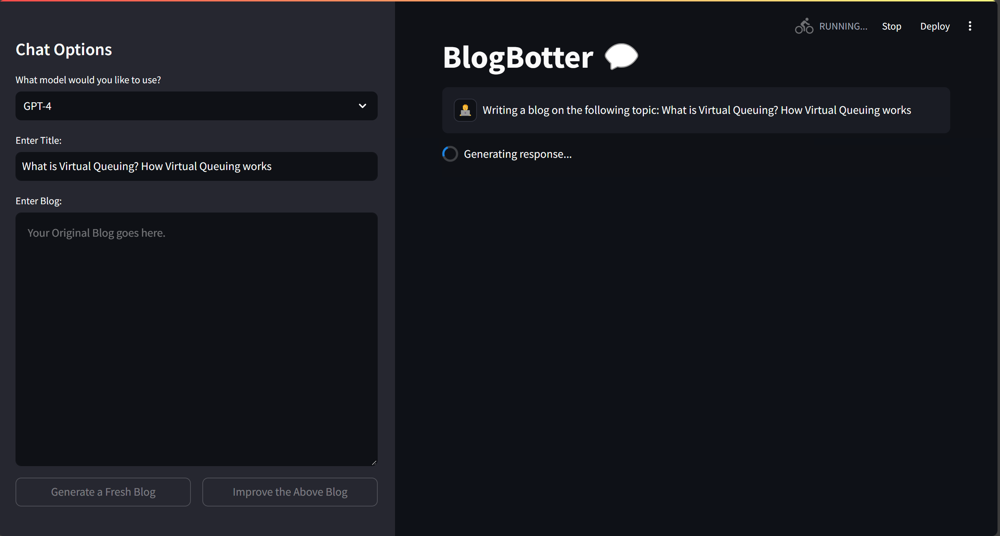
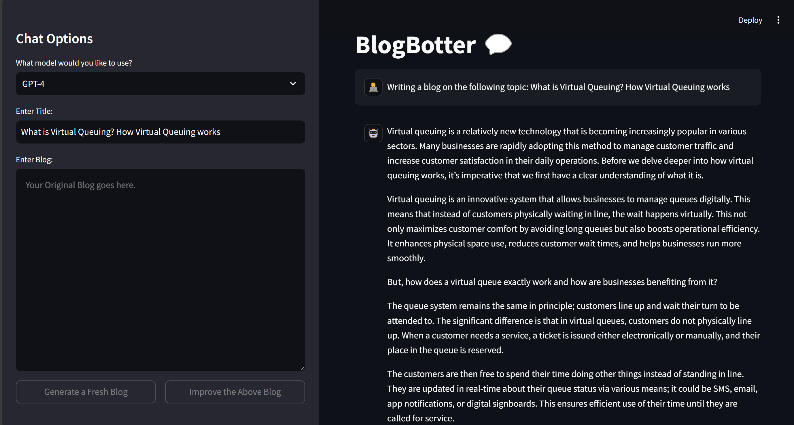

<h1>Blog Botter</h1>

<h3><b>Home Page:</b></h3>

<h3><b>Model Selection Capability:</b></h3>
<h4>Options:</h4>
<ul>
    <li><i>GPT-4.</li>
    <li>LLaMa.</li>
    <li>Gemini.</i></li>
</ul>

<h3><b>Giving 'Title' Input:</b></h3>

Enables the <b>'Generate a Fresh Blog'</b> Button.
 

<h3><b>Clicking on the 'Generate a Fresh Blog'</b> button:</h3>

<h3><b>Generating Blog as per the given 'Title':</b></h3>
<ul>
<li>
Final Blog can be seen in the right section.
</li>

<li>
Generated Blog can be exported in an HTML or PDF format using the <b>"Export"</b> button.
</li>
</ul>

<h3><b>Giving a 'Self-Written Blog' along with the 'Title':</b></h3>

Enables both the <b>'Generate a Fresh Blog'</b> and <b>'Improve the Above Blog'</b> Buttons.

<h3><b>Clicking on the 'Improve the Above Blog' button:</b></h3>

<h3><b>Improving Blog as per the given 'Title' and 'Blog':</b></h3>
<ul>
<li>
Improved Blog can be seen in the right section.
</li>
<li>
Using the title provided, a google search is being done and content for the Top 5 results is extracted and run through a <b>"WordNetlemmatizer"</b> in order to focus our new blog on the most frequently used 10 words.
</li>

<li>
Improved Blog can be exported in an HTML or PDF format using the <b>"Export"</b> button.
</li>

